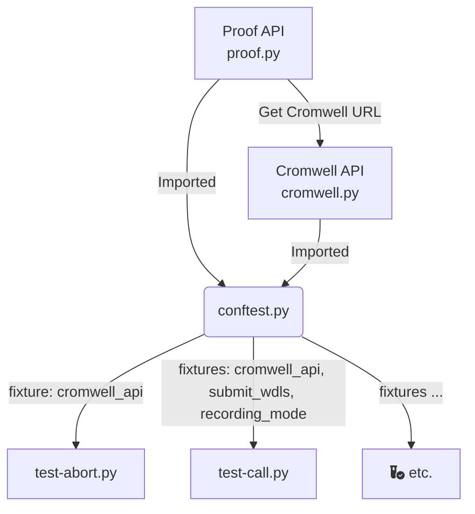

# Architecture

## File Structure

There's a few files for managing Python and the dependencies we use:

```
├── Makefile
├── pyproject.toml
├── pytest.ini
├── .python-version
├── .gitignore
└── uv.lock
```

- `Makefile`: make commands for running tests, formatting code, etc.
- `pyproject.toml`: details for managing the project, mostly just dependencies
- `pytest.ini`: pytest configuration
- `.python-version`: importantly tells `uv` what version of Python to use
- `.gitignore`: important to make sure we're not commiting lots of dot and python cache files, etc.
- `uv.lock`: lock file for uv to manage dependencies. we use the tool [uv](https://docs.astral.sh/uv/) to manage the python code

At the highest level tests are grouped by what they test against

```
tests
├── cromwellapi
└── cromwelljava
```

- `cromwellapi` : Run tests against the PROOF & Cromwell APIs running on Fred Hutch clusters
- `cromwelljava`: Run tests against a locally running java cromwell.jar file  (whether that be your machine or GH Actions)

Within `cromwelljava`

```
tests/cromwelljava
├── conftest.py
├── test-run.py
├── test-validate.py
└── utils.py
```

- `conftest.py` has a few fixtures used in tests
- `test-run.py`: runs `cromwell run` on all wdls
- `test-validate.py`:  runs `womtool validate` on all wdls
- `utils.py`: classes `Womtool` and `CromwellJava` for handling of running wdls against the java jar's

Within `cromwellapi`

```
tests/cromwellapi
├── cassettes
├── conftest.py
├── constants.py / mocks.py / utils.py / utils_cassettes.py / utils_dev.py
├── cromwell.py
├── cromwell_final.py
├── proof.py
├── labels1.json / mocked_submissions.json
├── test-*.py # all files that start with test-
```

- `cassettes`: directory with vcr "cassettes", stored/cached http request/response files so that we can save time running tests
- `conftest.py`: helper functions, fixtures for tests, vcr configuration (including filtering out sensitive information from cassettes), modifications to pytest header
- `constants.py` / `mocks.py` / `utils.py` / `utils_cassettes.py`: helpers
- `cromwell.py`: class to manage all normal interactions with the Cromwell API
- `cromwell_final.py`: class to manage interactions with the Cromwell API. specifically to fetch final state/status of workflow runs. only used for the `/metadata` route for now
- `proof.py`: class to manage interactions with the Proof API
- `labels1.json`: used in `/labels` Cromwell route as it expects a file uploaded that defines label options
- `mocked_submissions.json`: metadata stored for when we run vcr using cached cassettes
- `test-*.py`:  all tests that pytest runs

Tests within all `test-*.py` files have their own documentation that lives with the test code - if you're curious what those tests do read their docstrings; if they need more docs please open an issue or PR.

## How code flows together


